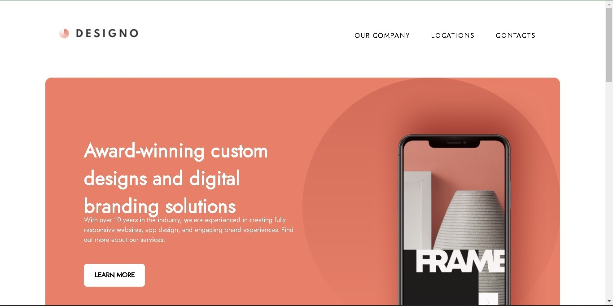

# Designo Landing Page



Welcome to the Designo Landing Page, a project created by the collaborative efforts of Anindo Choudhury and Sk Firdous Rahaman. This project is a frontend mentor challenge, showcasing our skills in web development and design.

## Overview

Designo is a fictional brand that represents creativity, innovation, and design excellence. The landing page we've crafted reflects the brand's essence through a modern and visually appealing design.

## Features

- **Responsive Design**: Our landing page is crafted to provide an optimal viewing experience across a wide range of devices and screen sizes.

- **Interactive Elements**: Engage users with smooth scrolling, interactive sections, and dynamic content, creating a delightful user experience.

- **Easy Navigation**: Intuitive navigation ensures visitors can seamlessly explore different sections of the landing page and discover more about Designo.

- **Call-to-Action**: Clearly defined call-to-action buttons encourage user interaction, driving engagement and conversions.

## Live Demo

Check out the live demo of the Designo Landing Page [here].

## Technologies Used

- HTML5
- CSS3 (including Flexbox and Grid)
- JavaScript

## Getting Started

To explore or contribute to the Designo Landing Page, follow these steps:

1. Clone the repository to your local machine.

   ```bash
   git clone https://github.com/your-username/designo-landing-page.git
   ```

2. Open the `index.html` file in your preferred web browser to view the landing page.

3. Make modifications or customize the content as needed.

## Contributing

We welcome contributions from the community to enhance the Designo Landing Page. If you have ideas for improvement or would like to report issues, please follow these steps:

1. Fork the repository.
2. Create a new branch for your changes.
3. Make your modifications and commit them with clear and concise messages.
4. Open a pull request, explaining the purpose and details of your changes.

## Acknowledgments

We would like to express our gratitude to Frontend Mentor for providing this challenging project, enabling us to showcase and improve our frontend development skills.

## License

This project is licensed under the [MIT License](LICENSE), allowing you to use, modify, and distribute the code for your projects.

Thank you for exploring the Designo Landing Page! We hope you find it inspiring and informative. If you have any questions or feedback, feel free to reach out.
